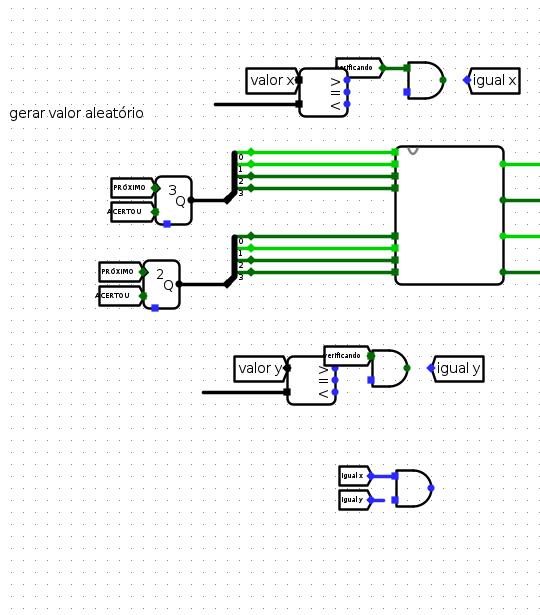
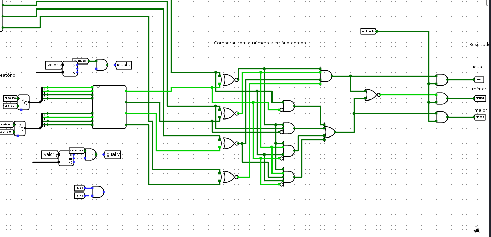
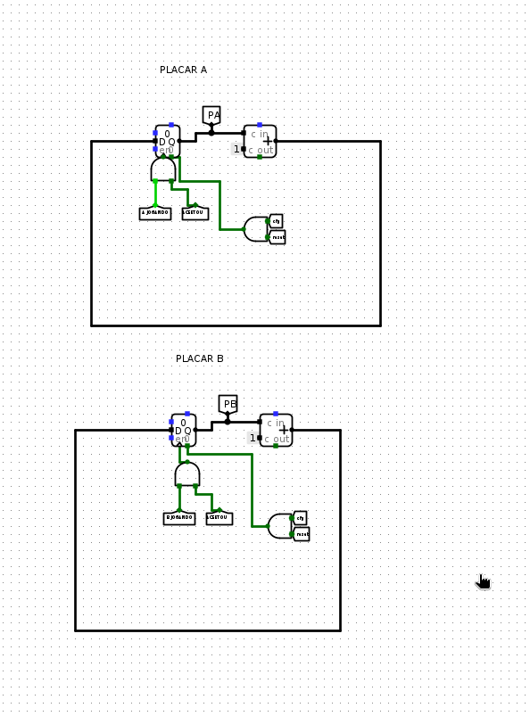
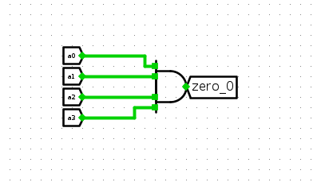
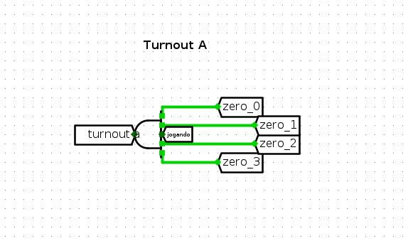
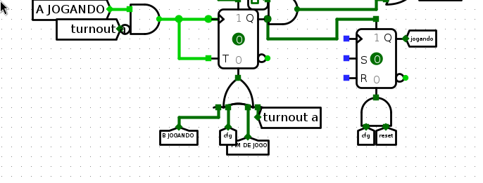
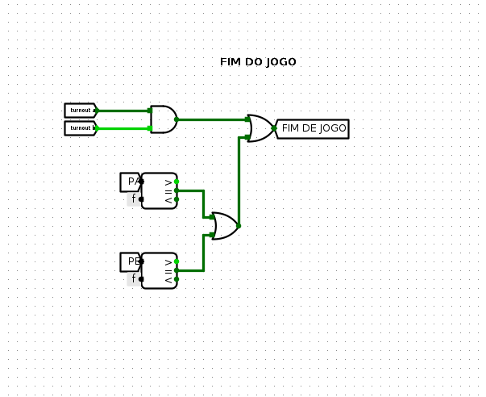
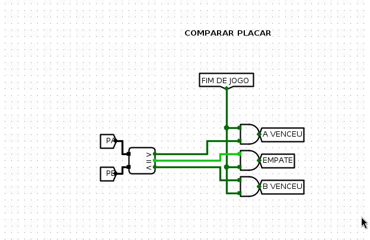
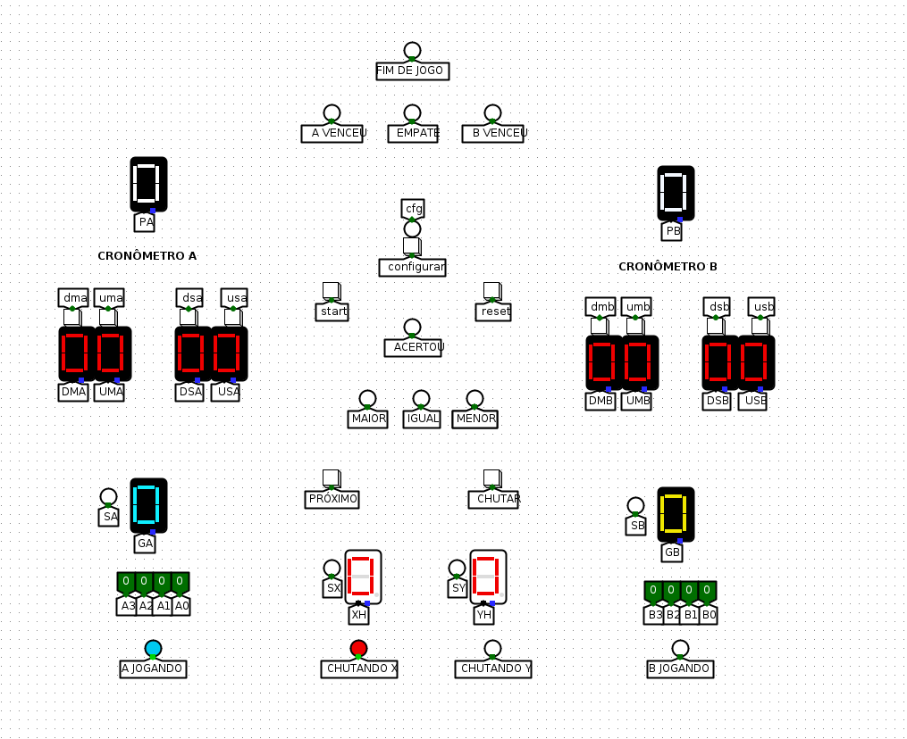

<h1 align="center">
    <p align="center">Guess The Number Extreme</p>

</h1>


## Índice

- [Sobre](#books-Sobre)


## :books: Sobre

Uma versão melhorada do primeiro projeto, (https://github.com/Hide349/Projeto_Circuitos_Digitais). Nesse jogo algumas coisas foram adicionadas, como por exemplo um cronômetro, placar, valores negativos e duas coordendadas para serem chutadas tornando assim o jogo bem mais divertido e dinâmico.

## Universidade

Projeto feito para disciplina de circuitos digitais do professor Ramon Santos na universidade **Universidade Federal do Cariri**. (https://www.ufca.edu.br/). 

## Ferramentas

- [Logisim](https://github.com/Logisim-Ita/Logisim)
- [java](https://www.java.com/pt-BR/)

## Clonar


```bash
    #Execute
    git clone https://github.com/Hide349/Guess-The-Number-Extreme.git
```
```bash
    #abrir logisim
    $ java -jar LOGISIM-ITA.jar 
```


## Por onde começar?
<p>Existem vários caminhos possíveis para concluir o projeto, o que eu escolhi dá o primeiro passo montando a tela que será apresentada para os jogadores, depois fazendo o cronômetro,chutes de x e y, alternador de jogadores, números aleatórios e fim de jogo<p>


## Tela 

<p>Para montar a tela é simples, basta usar a imagem de exemplo e copia-la</p>


Copiando a tela, a nossa ficará desse jeito.


## Cronômetro

Com a tela montada, precisaremos criar cada componente dela para que o jogo funcione.Portanto, começaremos com o cronômetro.Para monta-lo, utilizaremos de quatro unidade de memória flip flop do tipo d, um somador e vários túneis


## Funcionamento

Cada flip flop é responsável por guadar um bit, um cronômetro são basicamente 4 contadores. Dois de 0 até 9 e dois de 0 até 5. Com isso em mente percebe-se que essa é o primeiro dígito do cronômetro da esquerda para direita, ou seja, um contador de 0 até 9. Nesse caso, vai ser subtraido 1 até zero_A ser verdadeiro. Quando isso acontecer, utilizando dos preset e clear os flip flops vão ser obrigados a guardar o valor 1001 que seria o nove.

**Resumindo** : Esse seria um contador que vai de 9 até 0 e quando chega em zero volta para o nove. E o próximo contador teria um pulso de clock para decrementar uma unidade.

Repetindo a lógica faríamos mais três desses, em que dois seriam de 5 até 0( **dezenas** ) e mais um de 9 até 0( **unidades** ).

#### Partes restantes


<p></p>


<p></p>


## Chutes de x e y

<p>O jogo precisa de duas coordenas. O jogador chuta essas duas e então é informado se a soma delas é igual, menor ou maior que as soma das coordenas geradas.Bom, para fazer isso precisaremos de uma máquina de três estados, para assim termos o estado chutando x, chutando y e verificando. Isso para ambos o jogadores claro.</p>

#### Máquina de três estados

Para fazer uma máquina de três estados precisaremos de dois fliop flops do tipo d e uma porta and.Além de que, esse estado será atualizado quando o botão próximo for pressionado.


<p></p>

O primeiro estado seria o chutando x, com o and dois barrado (00), o segundo estado seria o chutando y que seria o q do segundo flip flop (01) e o estado verificando seria o (10). Com os três estados agora precisamos guardar os valores de chutando x e y e mostrar seus valores nos displays.

## Chutando x e y
<p></p>


<p>
<p>
<p>Um valor com 4 bits será passado, o que precisamos fazer é direcionalo para o flip flop correto. Por isso, o clock dele, ou seja, oque decide se ele pode ser ou não atualizado é um and que consiste do estado dele, um not verificado(apenas por garantia) e o botão chutar. Isso garante que apenas seja atualizado o valor quando estiver no estado correto e o botão chutar for pressioando.<b>A mesma coisa vale para y</b>.Depois disso é só mostrar o valor, fazendo com que o bit a3 seja o negativo ou positivo</p>

## Alternando Jogadores

<p>Para alternar entre dois jogadores teremos que utilizar dois flips flops, mas por que se são só dois estados? Na verdade, é importante lembrar que cada jogador tem o estado chutando x e chutando y. Então na verdade são 4 estados.</p>


#### Lógica

O jogador só será alternado quando ele já tiver feito dois chutes, ou seja, estar em estado de verificado e clicar em próximo de novo. **turnout a** (significa que o tempo de a chegou ao fim) então deve forçar que entre em b jogando, o mesmo funciona para **turnout b**. Além de que, a e b só podem estar jogando se nenhum dos dois teve ser tempo esgotado.

## Alternat inputs

<p>Com os jogadores alternando temos que alternar de onde vai ser a entrada de dados, apra isso utilizaremos uma sequência de portas and com os estados a jogando e b jogando.</p>


#### What?

<p>Os bits 0,1,2,3 podem receber ou valores de an ou bn. Para isso utilizaremos 4 portas or.Bom, para a0,a1,a2,a3 serem passados o jogador a tem que estar jogando e a mesma lógica vale para o jogador b.Por isso a sequência de portas and.Depois é só mostrar os valores que estão sendo passados</p>

## Somador de coordenadas

<p>Com as coordenadas em mãos temos que soma-las e checar se sua soma é maior,igual ou menor que as que foram geradas aleatoriamente</p>

O somador de coordenadas é um pouco diferente do comum, o bit a3 ou b3 signfica que a coordendada passada é negativa e para isso nós teremos que transformar o somador em um subtrador.

## halfadder


## fulladder


## adder(-)


A lógica para faze-lo é simples, o processo é o padrão no entanto a3 e b3 são bits que indicam se vai ser um subtrador ou um somador.

#### Usando adder(-)


## Gerando números aleatórios

<p>Agora é preciso gerar coordenadas aleatórias que serão comparadas com as chutadas pelo jogador.</p>

Utilizaremos o gerador de número aleatório oferecido pelo logisim, apenas o modificaremos para mudar o valor toda vez que um jogador acertar.


<p>Um novo valor deve ser gerado apenas quando o jogador que acertou apertar o botão próximo, para isso utilizaremos o enable do componente.O enable faz com que o componente funcione ou não e com isso podemos fazer com que o clock sendo próximo só gere um valor aleatório caso o jogador tenha acertado o número.</p>

#### Mas o que faz o jogador acertar?

No projeto pede que para que o jogador acerte ele tenha que chutar exatamente as mesmas coordenadas que foram geradas aleatoriamente.Na minha opnião isso dificulta demais o jogo e acaba o deixando um pouco monótono. Por isso fiz com que se acertar apenas a soma um ponto será contado mas ainda deixare a primeira lógica a disposição.



para fazer funcionar basta ligar os cabos.

## Comparando os valores

<p>Para comparar os valore utilizaremos o comparador que foi feito no projeto passado, mudando que o botão jogar agora vai ser o estado verificando.</p>



<p>Para comparar basta somar as coordenadas geradas aleatoriamente e comparar com a soma dos coordenadas chutadas, caso seja igual quer dizer que o jogador acertou (<b>pelo menos no meu modo</b>).</p>


## Placar

Para fazer o placar é necessário apenas um flip flop do tipo d para guadar o valor e um somador que irá incrimentar 1 toda vez que o jogador acertar.




## Fim de jogo

O jogo tem duas condições para acabar, ou o tempo dos dois jogadores chega em zero ou um deles chega a 15 no placar.Primeiro iremos fazer quando o tempo acabar.


### turnout

O tempo de um jogador acaba quando todos os contadores do seu cronômetro chegam a zero simultaneamente e claro, ele já tenha jogado uma vez.



<p></p>

Essa seria a condição que indicaria que um contador chegou a zero, repetindo isso para todos os contadores teríamos a condição de a zerou.



O tempo de a começaria zerado caso não tivesse a condição jogando.



Com isso o tempo de a só zera caso ele tenha inicado o jogo, a mesma lógica de zerar vale para b.

### Endgame

Com o turnout de a e b podemos chegar a condição de fim de jogo.



e a outra condição seria quando o placar de a ou b forem iguais a 15.

## Comparar placar

Agora que o jogo chegou o fim basta comparar para saber quem foi o campeão.




# Jogo completo

<p align="center"><b>Com tudo feito agora podemos aproveitar a gameplay.<b></p>

<h2 align="center"/>
    

</h2>
